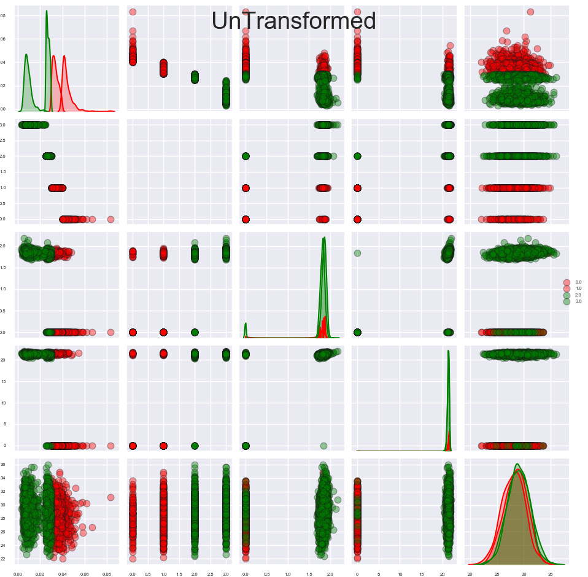
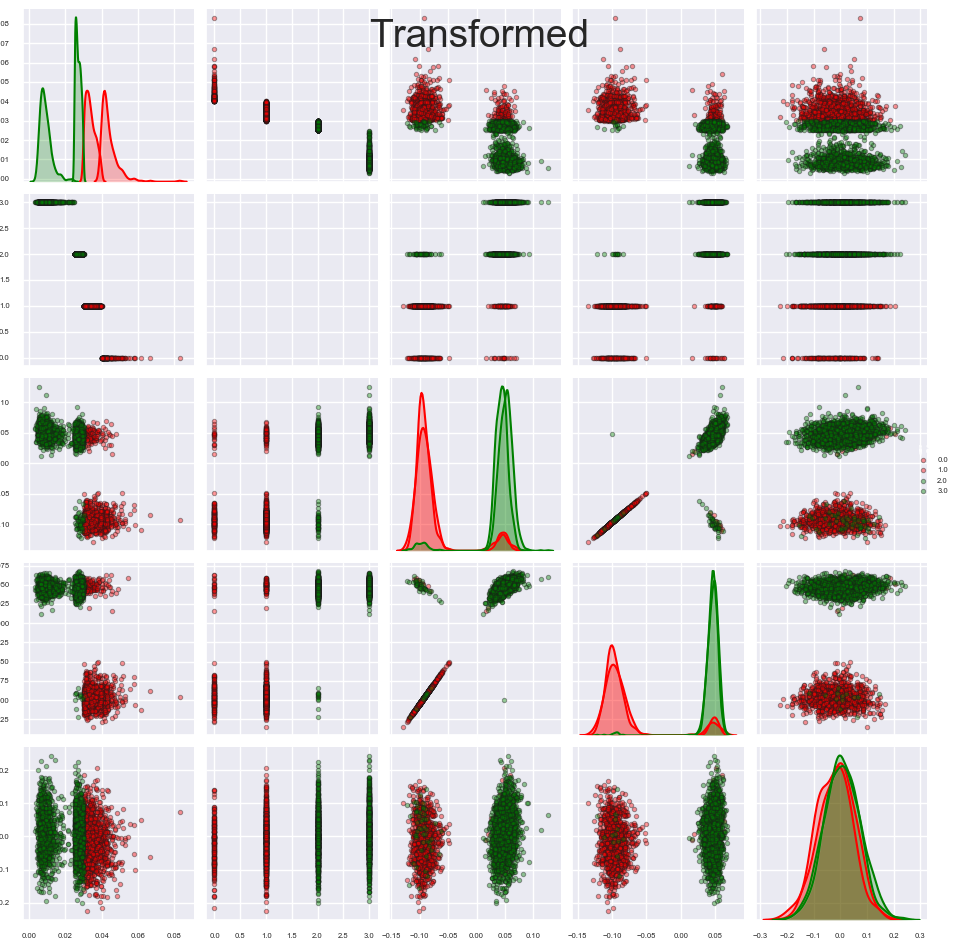
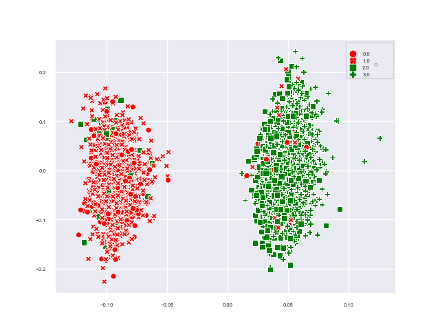

# FeatureScaling
Various Feature Scalings

# What is Feature Scaling

Feature Scaling or Standardization: It is a step of Data Pre Processing which is applied to independent variables or features of data. It basically helps to normalise the data within a particular range. Sometimes, it also helps in speeding up the calculations in an algorithm.

One of the most important transformations you need to apply to your data is feature scaling. With few exceptions, Machine Learning algorithms don’t perform well when the input numerical attributes have very different scales.

Feature Scaling is also so important for classification tasks.
Scatter matrix without Feature transformation or scaling.

Most of the classification algorithms can not perform well on this data with out transformation
** Some of the scatter plots in the picture below could be classified easily but those scatters have the target feature! Most of the time our task is to not use those target features. Because of that now we need to transform our data and we need to see the clear seperation with other features.

# After Transformation/Scaling
Now we can see better gauss distributions after some scalings and we can see all scatter plots have a good seperation. 
After transformation our classification algorithms perform better not only with target features also without target features.

# Example of seperation for 2 of input features
After scalings our algorithms performs much more better.

